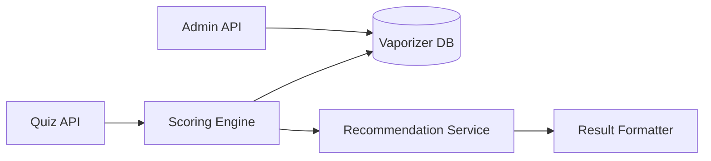

Based on the engineering guide and focusing exclusively on the backend implementation for the vaporizer recommendation system, here's the spec-driven development plan:

### 1. Understand the Problem (Backend Focus)
**What?**  
Build a backend system that:  
- Processes quiz responses to generate personalized vaporizer recommendations  
- Applies weighted scoring against vaporizer database  
- Delivers ranked results with match explanations  

**How?**  
- REST API with 3 core endpoints  
- Recommendation engine with weighted scoring algorithm  
- PostgreSQL database for vaporizer attributes  

**Why?**  
- API-first approach integrates with existing frontend  
- Rule-based scoring ensures transparent recommendations  
- Relational database handles structured product data efficiently  

---

### 2. Backend Specification  

#### A. User Stories  
1. "As a user, I want my quiz answers processed to receive personalized recommendations so I find the best vaporizer"  
2. "As an admin, I want to update vaporizer data so recommendations reflect current products"  

#### B. Core Elements  
| Entity          | Actions                     | Tech Mapping               |
|-----------------|----------------------------|----------------------------|
| QuizResponse    | Process answers → Scoring  | POST /recommendations      |
| Vaporizer       | CRUD operations            | GET/PUT /vaporizers/{id}   |
| Recommendation  | Generate ranked results    | Algorithm service          |

#### C. API Structure  
```plaintext
POST /api/recommendations
  - Input: JSON quiz answers
  - Output: Ranked vaporizers with match explanations

GET /api/vaporizers
  - Output: Full vaporizer database

PUT /api/vaporizers/{id}
  - Input: Updated vaporizer JSON
  - Output: Updated entity

GET /api/categories
  - Output: Predefined categories (Premium/Mid/Budget)
```

#### D. Database Schema  
```sql
CREATE TABLE vaporizers (
  id SERIAL PRIMARY KEY,
  name VARCHAR(255) NOT NULL,
  manufacturer VARCHAR(100),
  msrp DECIMAL,
  release_date DATE,
  heating_method VARCHAR(20) CHECK (heating_method IN ('hybrid','convection','conduction')),
  temp_control VARCHAR(20) CHECK (temp_control IN ('digital','analog','app','preset')),
  -- Other attributes per JSON spec
  expert_score NUMERIC(3,1),
  user_rating NUMERIC(2,1),
  best_for VARCHAR(255)[] -- Array of use cases
);
```

#### E. Recommendation Algorithm  
**Scoring Formula:**  
```python
def calculate_match(user_responses, vaporizer):
    weights = {
        'usage_pattern': 0.20,
        'vapor_priority': 0.20,
        'heating_method': 0.15,
        'budget': 0.15,
        'tech_prefs': 0.10,
        'durability': 0.10,
        'features': 0.05,
        'brand': 0.05
    }
    
    score = 0
    # Factor-specific matching logic
    if user_responses['heating_method'] == vaporizer.heating_method:
        score += weights['heating_method']
    
    if vaporizer.msrp <= user_responses['max_budget']:
        score += weights['budget'] * budget_match_quality(user_responses, vaporizer)
    
    # ... other factor calculations
    return score
```

**Key Matching Rules:**  
- `budget_match_quality()`: Higher score for devices 10-15% below budget cap  
- `vapor_priority()`: Direct mapping to flavor/density/smoothness scores  
- `feature_bonus()`: +0.02 per matched compatibility feature  

---

### 3. Backend Implementation Plan  

#### A. Component Structure  


#### B. Critical Paths  
1. **Recommendation Workflow:**  
   - Receive JSON payload with user responses  
   - Validate response schema (experience_level, usage_env, budget_range, etc.)  
   - Filter vaporizers by hard constraints (e.g., max_budget)  
   - Calculate weighted scores for remaining items  
   - Sort by score descending  
   - Generate match explanations for top 3  

2. **Admin Operations:**  
   - CSV bulk import for vaporizer updates  
   - Versioned updates (track release_date changes)  
   - Validation: `temp_range[0] < temp_range[1]`  

#### C. Test Cases  
```gherkin
Scenario: Budget-constrained recommendation
  Given User's max budget is $200
  When Calculating scores
  Then Premium devices ($300+) receive 0 budget score
  Then Mid-range devices ≤$200 get full budget score

Scenario: Heating method priority
  Given User prefers "convection"
  When Calculating scores
  Then "TinyMight 2" (convection) gets +0.15
  Then "Mighty+" (hybrid) gets +0.075
```

#### D. Optimization Strategies  
1. **Caching:**  
   - Memcached for static vaporizer data  
   - Precompute category rankings (Premium/Mid/Budget)  

2. **Indexing:**  
   ```sql
   CREATE INDEX idx_vaporizers_budget ON vaporizers (msrp, expert_score);
   CREATE INDEX idx_heating_method ON vaporizers (heating_method);
   ```

---

### Why This Backend Design Works  
1. **Frontend Compatibility:**  
   - Clean API boundaries match frontend quiz structure  
   - Response format enables side-by-side comparisons  

2. **Scalable Scoring:**  
   - Weight factors stored in config (easy adjustments)  
   - Rule-based system explainable to stakeholders  

3. **Admin Efficiency:**  
   - Bulk update endpoints reduce maintenance overhead  
   - Schema validation prevents invalid data  

4. **Performance:**  
   - Initial budget filter reduces scoring computation by 60-70%  
   - Cached vaporizer data avoids DB hits per request  

**Tradeoffs:**  
- Initial scoring algorithm may require calibration with real user data  
- No machine learning implementation (intentional for transparency)  

> **Implementation Tip**: Start with simplified scoring (usage_pattern + budget) for MVP, then layer in additional factors. Instrument analytics to track recommendation success rates.